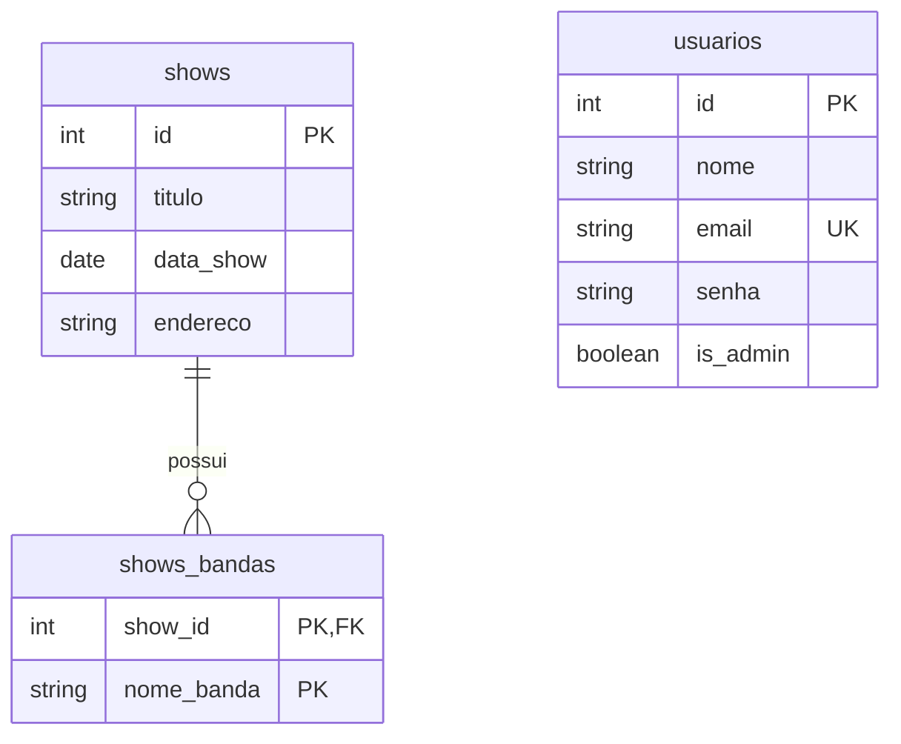

```mermaid
erDiagram
    shows ||--o{ shows_bandas : possui
    usuarios {
        int id PK
        string nome
        string email UK
        string senha
        boolean is_admin
    }
    shows {
        int id PK
        string titulo
        date data_show
        string endereco
    }
    shows_bandas {
        int show_id PK, FK
        string nome_banda PK
    }
```
